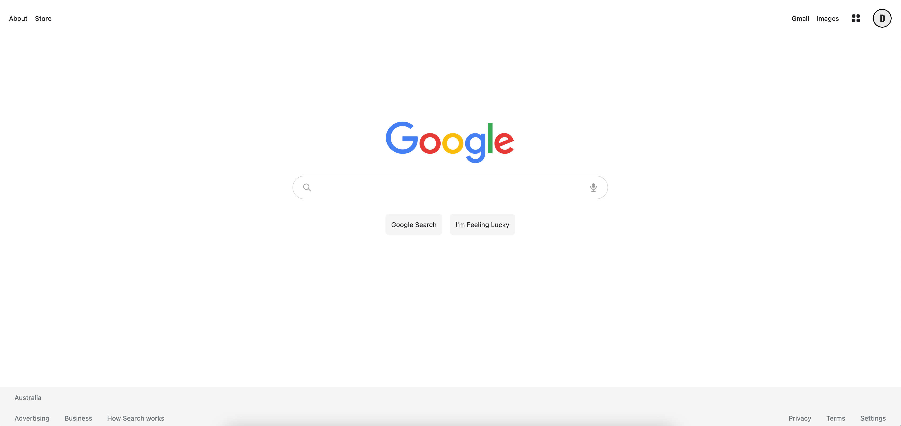
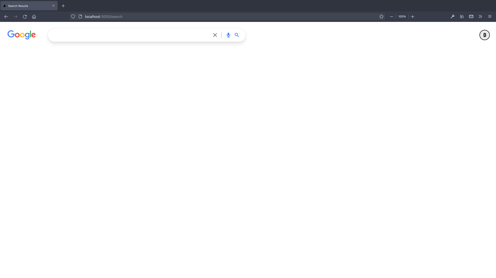
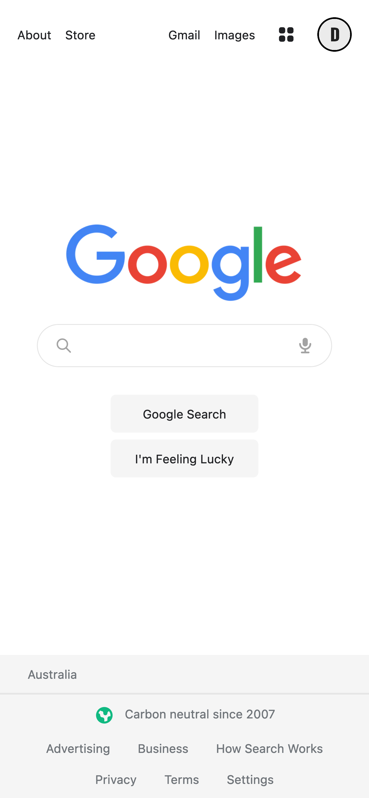
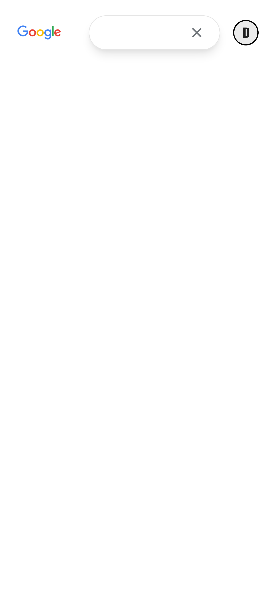

# Google 2.0

Google search engine I'm currently building with React (Next.js) and Tailwind CSS. (Responsive, Server-Side Rendering, Pagination, TypeScript). The app will use Google's Search API to display results.

Created with, [Next.js](https://nextjs.org/) and [Tailwind CSS](https://tailwindcss.com/).

# Current State






## Getting Started

First, run:

```bash
npm install
```

Run the development server:

```bash
npm run dev
```

Open [http://localhost:3000](http://localhost:3000) with your browser to see the result.

## Learn More

To learn more about Next.js, take a look at the following resources:

- [Next.js Documentation](https://nextjs.org/docs) - learn about Next.js features and API.
- [Learn Next.js](https://nextjs.org/learn) - an interactive Next.js tutorial.

You can check out [the Next.js GitHub repository](https://github.com/vercel/next.js/).
